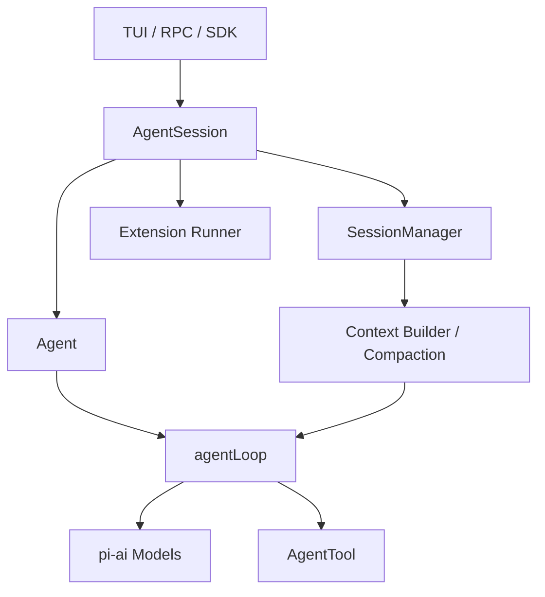
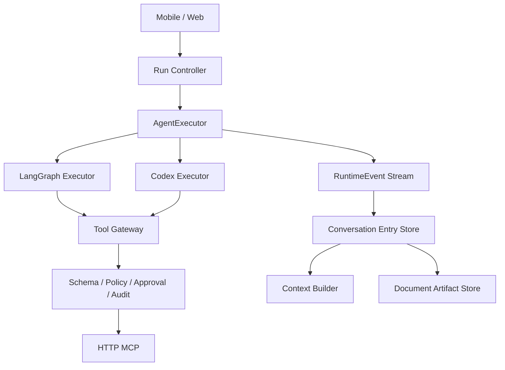

# Pi Agent Runtime 源码学习笔记

## 研究范围
- 项目：[earendil-works/pi](https://github.com/earendil-works/pi)
- 快照：[`588915ec`](https://github.com/earendil-works/pi/tree/588915ec71714688cee8b7153339e8bdebb3e82e)
- 日期：2026-08-05
- 目标：理解 Pi 如何组织模型、Agent 循环、工具、事件、会话、上下文和扩展，并判断哪些思想适合 Nubbi Assistant。

Pi 的价值不在复杂工作流 DSL，而在用少量稳定协议构成可扩展 Agent Runtime。它把“模型如何调用”“Agent 如何循环”“产品如何保存会话”“界面如何展示”拆成不同层级。
## 一、项目分层
| 层级 | Pi 包 | 职责 |
| --- | --- | --- |
| 模型层 | `pi-ai` | 多 Provider 模型、流式协议、模型目录、API Key 与 OAuth |
| Agent 内核 | `pi-agent-core` | 状态、Agent 循环、工具执行、事件流和消息队列 |
| 产品运行时 | `pi-coding-agent` | 会话、上下文压缩、代码工具、扩展、Skill 和 SDK |
| 交互层 | `pi-tui` | 终端组件和增量渲染 |
| 远程接入 | `protocol/client/server` | 将会话运行时暴露给其他进程或客户端 |



关键思想：**底层循环只负责模型与工具交互，产品生命周期放在 AgentSession 外层。**

## 二、核心 Agent 循环
核心实现位于 [`agent-loop.ts`](https://github.com/earendil-works/pi/blob/588915ec71714688cee8b7153339e8bdebb3e82e/packages/agent/src/agent-loop.ts)。它没有图编排，而是两个循环：

```text
外层循环：处理正常结束后排队的 follow-up
  内层循环：模型响应 -> 工具调用 -> steering -> 下一轮模型响应
```

一次 Turn 是“一次模型调用，加上该响应产生的全部工具调用”：
1. 将待处理用户消息加入上下文。
2. 用 `transformContext()` 裁剪、压缩或注入外部上下文。
3. 用 `convertToLlm()` 转换成模型消息。
4. 调用注入的 `streamFn`，接收文本、思考和工具参数增量。
5. 校验、授权并执行工具，将结果回填上下文。
6. 再次调用模型，直到没有工具和排队消息。

Agent 的本质是“状态 + 模型决策 + 动作 + 观察 + 停止条件”。Pi 循环适合单 Agent 内部执行；LangGraph 更适合多个确定性阶段和多个 Agent 之间的编排。

## 三、消息与上下文分离
Pi 明确区分 [`AgentMessage`](https://github.com/earendil-works/pi/blob/588915ec71714688cee8b7153339e8bdebb3e82e/packages/agent/src/types.ts) 和模型 `Message`：
- `AgentMessage` 可以包含 UI 通知、命令结果、压缩摘要和分支摘要。
- 模型只接受 `user`、`assistant` 和 `toolResult`。
- `transformContext` 决定保留哪些上下文。
- `convertToLlm` 决定模型如何理解上下文。

[`messages.ts`](https://github.com/earendil-works/pi/blob/588915ec71714688cee8b7153339e8bdebb3e82e/packages/agent/src/harness/messages.ts) 会过滤纯 UI 消息，并把摘要转换为模型消息。Assistant 当前 `MessagePart` 已能保存文本、Skill、审批和工具结果，但 `modelHistory()` 只恢复文本；后续应增加明确的 `ConversationEntry -> ModelMessage` 转换层。

## 四、事件是一等协议
Pi 不让 UI 猜测 Agent 状态，而是发出完整生命周期：

```text
agent_start -> turn_start
message_start / message_update / message_end
tool_execution_start / update / end
turn_end -> agent_end
```

[`Agent`](https://github.com/earendil-works/pi/blob/588915ec71714688cee8b7153339e8bdebb3e82e/packages/agent/src/agent.ts) 消费事件、更新状态并通知订阅者。上层还区分 `agent_end` 与没有重试、压缩和排队任务的 `agent_settled`。

Assistant 应建立统一 `RuntimeEvent`，让 OpenAI-compatible、Codex 和未来多 Agent 输出同一种事件，而不是由 SSE 路由理解各执行器内部细节。

## 五、工具执行流水线
Pi 的工具调用是一条受控流水线：

```text
查找工具 -> 修正参数 -> Schema 校验 -> beforeToolCall
-> 执行与进度 -> afterToolCall -> ToolResult -> 模型上下文
```

重要细节：
- 未知工具、错误参数和执行异常都转换为标准错误 ToolResult。
- `beforeToolCall` 可阻止调用，适合权限、审批和策略。
- `afterToolCall` 可脱敏、补审计信息或改变终止行为。
- 只读工具可以并行，有副作用的工具可以强制顺序执行。
- 并行完成顺序可不同，但 ToolResult 按模型原调用顺序写入上下文。
- 工具可以流式报告进度，也可以用 `terminate` 结束自动追问。

Assistant 的 `tool-executor.ts` 已有审批和 MCP 调用，但还缺统一参数校验、前后 Hook、工具级执行模式、进度事件和标准错误结构。

## 六、运行中的用户输入
Pi 用两个队列处理 Agent 工作时的新消息：
- `steer`：当前 Turn 完成后尽快注入，用于改变方向。
- `followUp`：Agent 原本将结束时注入，用于追加任务。

Assistant 当前用全局 `activeGeneration` 拒绝第二条消息。可以先保留单任务限制，未来应改成每个会话独立的消息队列，而不是直接开放并发写状态。

## 七、会话不是消息数组
Pi 的 [`SessionManager`](https://github.com/earendil-works/pi/blob/588915ec71714688cee8b7153339e8bdebb3e82e/packages/coding-agent/src/core/session-manager.ts) 使用 append-only JSONL，每条记录用稳定 `id` 和 `parentId` 组成树，可表达：
- 用户、模型消息和工具结果
- 模型或思考等级变化
- 自定义扩展状态
- 上下文压缩点
- 回退、分支、Fork、名称与标签

它避免重写整个会话文件，也不会因新分支丢弃旧路径。完整格式见 [`session-format.md`](https://github.com/earendil-works/pi/blob/588915ec71714688cee8b7153339e8bdebb3e82e/packages/coding-agent/docs/session-format.md)。Assistant 第一阶段不必立即实现树，但应把领域对象改为：

```text
Conversation -> Run -> Entry -> Artifact
```

Artifact 表示总结文档、代码补丁、报告或导出文件。

## 八、上下文压缩与用户总结
Pi 在上下文接近窗口时压缩旧消息并保留近期消息。压缩记录包括摘要、压缩前 Token、保留尾部和文件轨迹，详见 [`compaction.md`](https://github.com/earendil-works/pi/blob/588915ec71714688cee8b7153339e8bdebb3e82e/packages/coding-agent/docs/compaction.md)。

| 类型 | 服务对象 | 输出位置 |
| --- | --- | --- |
| Context Compaction | 模型 | 重新进入后续模型上下文 |
| 用户总结文档 | 用户 | 独立 Artifact，可编辑和引用 |

Assistant 当前要做的是第二种，但应保留以后把摘要作为 Context Checkpoint 使用的能力。

## 九、Provider 与认证
Pi 用 `pi-ai` 统一模型、流式事件、模型目录、费用和认证；`streamFn` 通过依赖注入交给 Agent Core。[`ModelRuntime`](https://github.com/earendil-works/pi/blob/588915ec71714688cee8b7153339e8bdebb3e82e/packages/coding-agent/src/core/model-runtime.ts) 再组合内置 Provider、自定义 Provider、配置和 OAuth。

Assistant 可借鉴 Provider 接口，但应先统一两个执行后端：

```ts
interface AgentExecutor {
  run(input: AgentRunInput): AsyncIterable<RuntimeEvent>;
  cancel(runId: string): Promise<void>;
}
```

由 `LangGraphExecutor` 和 `CodexExecutor` 实现同一协议。

## 十、扩展哲学与安全差异
Pi 把 Skill、Prompt、工具、命令、Provider、UI 和生命周期 Hook 做成扩展，参考 [`extensions.md`](https://github.com/earendil-works/pi/blob/588915ec71714688cee8b7153339e8bdebb3e82e/packages/coding-agent/docs/extensions.md)。但它有意不内置 MCP、子 Agent、权限弹窗和 Plan Mode，并默认继承启动进程权限。

这部分不能照搬：
- Nubbi 明确要求 MCP，应继续把它作为一等 Tool Gateway。
- 手机审批是产品核心，不能退化为可选扩展。
- 服务端保存用户 Token，必须有明确凭据边界。
- 第三方任意 TypeScript 扩展风险较高，不能默认开放。

当前 `pi-agent-core` 和 `pi-coding-agent` 还要求 Node.js 22.19+，而 Assistant 基线是 Node.js 20+；直接引入会提高环境要求，并与现有 LangGraph 重叠。

## 十一、与当前 Assistant 对照
| 能力 | Pi | 当前 Assistant | 建议 |
| --- | --- | --- | --- |
| Agent 循环 | 手写流式循环 | LangGraph model/tools 图 | 保留 LangGraph，完善事件协议 |
| Provider | 多 Provider Runtime | OpenAI-compatible + Codex | 先抽象统一 Executor |
| 工具 | Hook、校验、并行 | Skill/MCP + 审批 | 增加 Tool Gateway 流水线 |
| 事件 | 完整生命周期 | SSE 文本/工具/审批 | 建立统一 RuntimeEvent |
| 会话 | append-only JSONL 树 | 重写 conversations.json | 先改 append-only Entry |
| 上下文 | 转换、压缩、分支摘要 | 最近 30 条纯文本 | 增加 ContextBuilder |
| 运行中输入 | steer/followUp | 全局拒绝并发 | 改为按会话排队 |
| 扩展 | 任意 TypeScript Hook | Skill + MCP | 保持受控扩展 |
| 权限 | 外部沙箱负责 | 手机逐次审批 | 保留 Assistant 方案 |

## 十二、建议吸收到 Assistant 的架构


第一批可以实施：统一 `AgentExecutor/RuntimeEvent`；拆分 Tool Gateway；改用 append-only Entry；增加 ContextBuilder；增加结构化 Summary Artifact。

## 十三、围绕当前需求的学习实践
“对话和总结文档落地”可以作为第一个完整练习：

```text
用户对话 -> Agent 执行 -> 判断是否总结 -> 生成结构化 Summary
-> Schema 校验 -> 确定性代码生成 Markdown -> 保存 Artifact
-> artifact-created 事件 -> 后续对话通过 ContextBuilder 引用
```

Summary 至少包含：用户目标、已确认需求、关键决策、已完成事项、待办、风险、相关工具结果和下一步。这个练习会覆盖模型调用、状态循环、结构化输出、工具边界、事件流、持久化、上下文恢复和用户可见产物。
## 十四、本次落地选择

Assistant 已采用统一 RuntimeSession、Provider Executor、RuntimeEvent、ContextBuilder 和 Tool Gateway。Run 语义事件先写入 append-only JSONL，会话消息仍保留 JSON 投影；这是向事件化存储过渡，而不是一次迁移全部会话。

“对话总结并保存”最终实现为普通 Skill，由 Agent 自动选择 MCP 文档工具。首期不增加专用 Artifact API、预览页或固定 Nubbi 通道，避免示例能力反过来限制通用 Runtime。steer/followUp、完整会话事件源和多 Agent 调度继续作为后续阶段。

## 结论
Pi 最值得学习的是四条原则：
1. 保持 Agent 内核小，把产品生命周期放在 Session 层。
2. 产品消息、模型上下文和持久化记录必须分离。
3. 工具调用是受控流水线，事件是稳定公共协议。
4. 长期会话需要 append-only 记录、上下文压缩和 Artifact，而不只是消息数组。
Nubbi 不需要放弃 LangGraph 或改用 Pi。合适路线是：LangGraph 管确定性流程和未来多 Agent 编排，同时吸收 Pi 在单 Agent 循环、事件协议、会话模型、工具 Hook 和上下文管理方面的思想。
