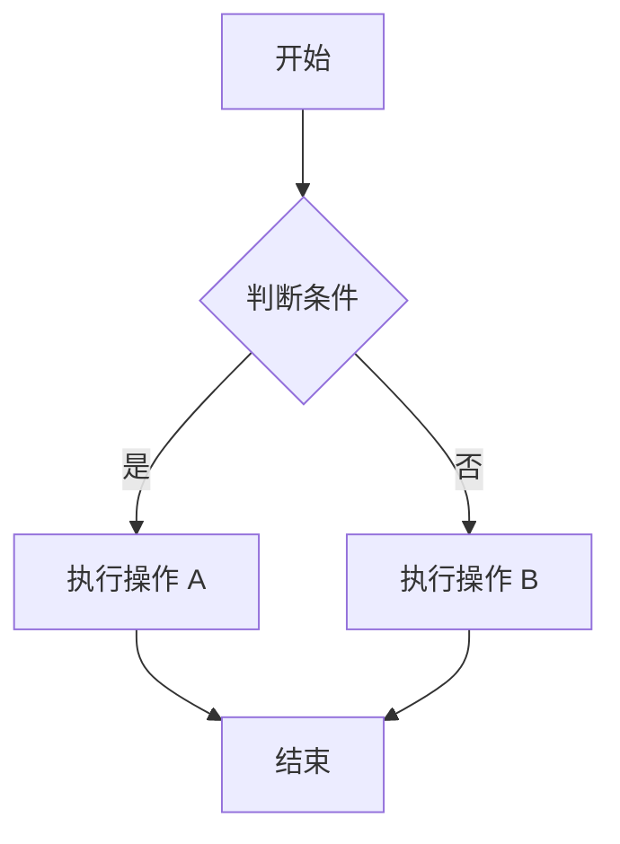
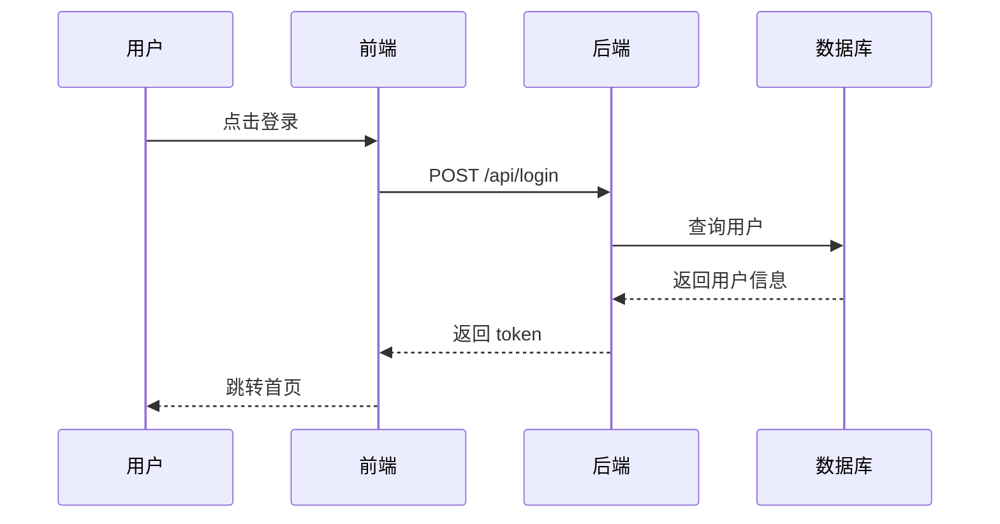

# Markdown 粘贴测试文档

> 复制本文档全部内容，粘贴到编辑器中，检查各渲染块展示是否正确。

---

## 1. 标题层级

# 一级标题 Heading 1
## 二级标题 Heading 2
### 三级标题 Heading 3
#### 四级标题 Heading 4
##### 五级标题 Heading 5
###### 六级标题 Heading 6

---

## 2. 段落与行内样式

这是一段普通段落，包含**粗体文字**、*斜体文字*、~~删除线~~、`行内代码`、[超链接](https://example.com)。段落中还可以有带格式的 `const foo = "bar"` 行内代码，以及 **粗体中嵌套*斜体*文字**。

这是另一段。中文标点测试：，。！？；：""''（）【】《》—…

连续两个段落之间应有正常的间距。

---

## 3. 列表

### 无序列表

- 第一项
- 第二项
  - 嵌套子项 A
  - 嵌套子项 B
    - 三级嵌套
- 第三项

### 有序列表

1. 第一步
2. 第二步
   1. 子步骤 a
   2. 子步骤 b
3. 第三步

### 混合内容列表

- 包含**粗体**的列表项
- 包含 `代码` 的列表项
- 包含 [链接](https://example.com) 的列表项
- 包含多段落的列表项

  这是列表项内的第二个段落。应缩进对齐。
  
- 列表中的代码块：

  ```javascript
  console.log("在列表中");
  ```

---

## 4. 引用块

> 这是一段引用。引用内可以有**粗体**、*斜体*等行内样式。

> 多级引用：
>> 这是嵌套引用。Lorem ipsum dolor sit amet, consectetur adipiscing elit.

> 引用中包含列表：
> - 引用列表项 1
> - 引用列表项 2

---

## 5. 代码块

### JavaScript

```javascript
function fibonacci(n) {
  if (n <= 1) return n;
  return fibonacci(n - 1) + fibonacci(n - 2);
}

const result = fibonacci(10);
console.log(result); // 55
```

### TypeScript

```typescript
interface User {
  id: string;
  name: string;
  email: string;
}

async function fetchUser(id: string): Promise<User> {
  const response = await fetch(`/api/users/${id}`);
  if (!response.ok) {
    throw new Error(`HTTP ${response.status}`);
  }
  return response.json() as Promise<User>;
}
```

### Python

```python
def quick_sort(arr: list[int]) -> list[int]:
    if len(arr) <= 1:
        return arr
    pivot = arr[len(arr) // 2]
    left = [x for x in arr if x < pivot]
    middle = [x for x in arr if x == pivot]
    right = [x for x in arr if x > pivot]
    return quick_sort(left) + middle + quick_sort(right)

print(quick_sort([3, 6, 8, 10, 1, 2, 1]))
```

### CSS

```css
.container {
  display: grid;
  grid-template-columns: repeat(auto-fill, minmax(300px, 1fr));
  gap: 1.5rem;
  padding: 2rem;
}

.card {
  border-radius: 12px;
  background: #ffffff;
  box-shadow: 0 4px 12px rgba(0, 0, 0, 0.08);
  transition: transform 0.2s ease;
}

.card:hover {
  transform: translateY(-2px);
}
```

### SQL

```sql
SELECT
  u.id,
  u.name,
  COUNT(o.id) AS order_count,
  SUM(o.total) AS total_spent
FROM users u
LEFT JOIN orders o ON o.user_id = u.id
WHERE u.created_at >= '2024-01-01'
GROUP BY u.id, u.name
HAVING COUNT(o.id) > 0
ORDER BY total_spent DESC
LIMIT 20;
```

### Shell

```bash
#!/bin/bash
set -euo pipefail

echo "Starting deployment..."
for service in api worker scheduler; do
  echo "Deploying $service..."
  kubectl rollout restart "deployment/${service}"
  kubectl rollout status "deployment/${service}" --timeout=300s
done
echo "Deployment complete!"
```

### JSON

```json
{
  "name": "example-project",
  "version": "2.1.0",
  "scripts": {
    "dev": "vite",
    "build": "tsc && vite build",
    "preview": "vite preview"
  },
  "dependencies": {
    "react": "^19.0.0",
    "react-dom": "^19.0.0"
  }
}
```

### Mermaid 流程图



### Mermaid 时序图



### 无语言标注的代码块（缩进）

    This is an indented code block
    No language specified
    Should render as plain text / auto-detect

---

## 6. 表格

### 基础表格

| 名称 | 类型 | 必填 | 说明 |
|------|------|------|------|
| id | `string` | 是 | 唯一标识符 |
| name | `string` | 是 | 用户名称，2-20 个字符 |
| email | `string` | 是 | 邮箱地址 |
| age | `number` | 否 | 年龄，0-150 |
| created_at | `datetime` | 否 | 创建时间 |

### 对齐表格

| 左对齐 | 居中对齐 | 右对齐 |
|:-------|:--------:|-------:|
| Apple | Red | $1.00 |
| Banana | Yellow | $0.50 |
| Cherry | Dark Red | $2.50 |

### 含行内样式的表格

| 功能 | 状态 | 备注 |
|------|------|------|
| 登录 | ✅ 已完成 | `auth.login()` |
| 注册 | 🔄 进行中 | 需要验证邮箱 |
| 支付 | ❌ 未开始 | *等待第三方接入* |

---

## 7. 分割线

上面的内容。

---

分割线后换一段文字。

***

三个星号分割线。

___

下划线分割线。

---

## 8. 图片


带标题的图片：


---

## 9. 任务列表

- [x] 已完成的任务
- [x] 也已完成
- [ ] 待办事项
- [ ] 另一个待办
- [ ] 嵌套任务
  - [x] 嵌套已完成
  - [ ] 嵌套待办

---

## 10. 转义与特殊字符

- HTML 实体: &lt;div&gt; &amp; &quot; &copy; &reg; &trade;
- 数学符号: ≤ ≥ ≠ ≈ ± × ÷ √ ∞ ∑ ∏ ∫ ∂ ∆
- 箭头: → ← ↑ ↓ ↔ ⇒ ⇐ ⇑ ⇓
- 货币: ¥ € £ $ ₹
- Em Dash — En Dash –
- 反斜杠转义: \* \_ \` \[ \] \( \) \# \+ \- \. \!

---

## 11. 连续边界测试

### 标题后直接跟段落
紧接着标题的文字，中间没有空行会怎样？

### 多个列表紧邻

- 列表 A 项 1
- 列表 A 项 2

1. 列表 B 项 1
2. 列表 B 项 2

### 代码块后跟引用

```python
print("hello")
```

> 代码块后面的引用。间距应统一。

### 分割线与标题紧邻

---
### 紧挨分割线的标题

---

## 12. 长内容

这是一段很长的段落，用于测试编辑器的自动换行和渲染性能。Lorem ipsum dolor sit amet, consectetur adipiscing elit. Sed do eiusmod tempor incididunt ut labore et dolore magna aliqua. Ut enim ad minim veniam, quis nostrud exercitation ullamco laboris nisi ut aliquip ex ea commodo consequat. Duis aute irure dolor in reprehenderit in voluptate velit esse cillum dolore eu fugiat nulla pariatur. Excepteur sint occaecat cupidatat non proident, sunt in culpa qui officia deserunt mollit anim id est laborum. 中文长文本测试：春江潮水连海平，海上明月共潮生。滟滟随波千万里，何处春江无月明。江流宛转绕芳甸，月照花林皆似霰。空里流霜不觉飞，汀上白沙看不见。江天一色无纤尘，皎皎空中孤月轮。

---

## 13. 空行边界

段落 A


段落 B（中间有两个空行）

---

## 14. HTML 混入

<b>粗体 HTML</b> <i>斜体 HTML</i> <u>下划线 HTML</u>

<details>
<summary>折叠区域</summary>

折叠内容。部分编辑器可能不支持。

</details>

---

## 15. 脚注样式 [^1]

这是一段带有脚注引用 [^1] 的文字。

[^1]: 这是脚注的内容。

---

## 16. 定义列表（若支持）

术语
: 这是术语的定义。

另一个术语
: 这也是一个定义。

---

> 测试完成。
> 
> **检查清单：**
>
> - [ ] 所有标题层级正确渲染
> - [ ] 粗体、斜体、删除线、行内代码正确
> - [ ] 无序列表和有序列表（含嵌套）正确
> - [ ] 引用块（含嵌套）正确
> - [ ] 代码块语法高亮正常
> - [ ] Mermaid 图表正确渲染
> - [ ] 表格显示正确
> - [ ] 分割线正常
> - [ ] 图片加载显示
> - [ ] 任务列表正常
> - [ ] 各块间距统一（2px gap + CSS 变量控制）
> - [ ] block 选中遮罩层覆盖所有块
> - [ ] 链接可点击
> - [ ] 特殊字符无乱码
